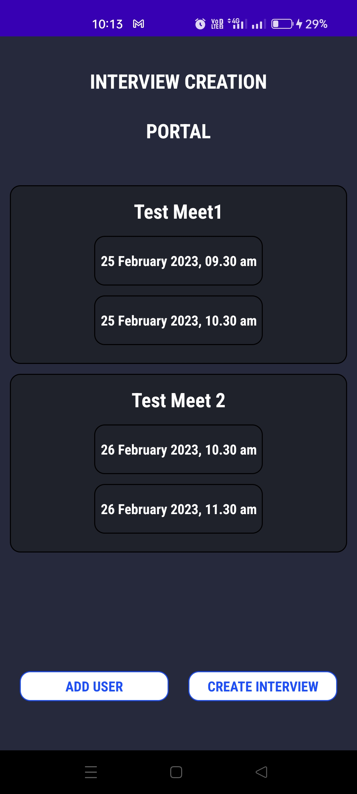
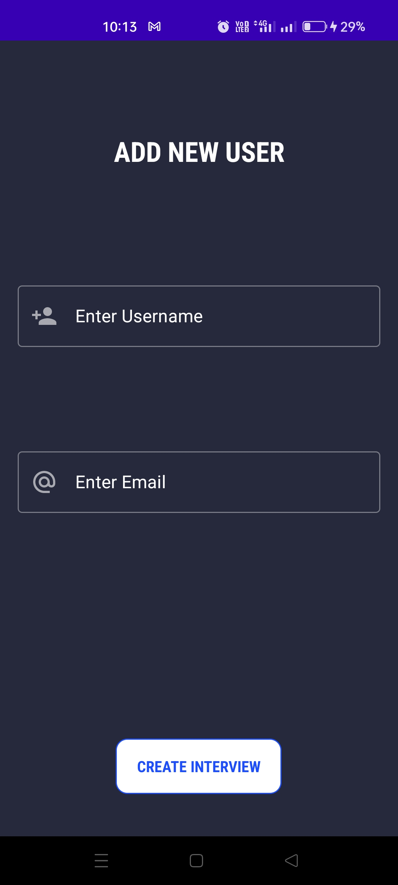
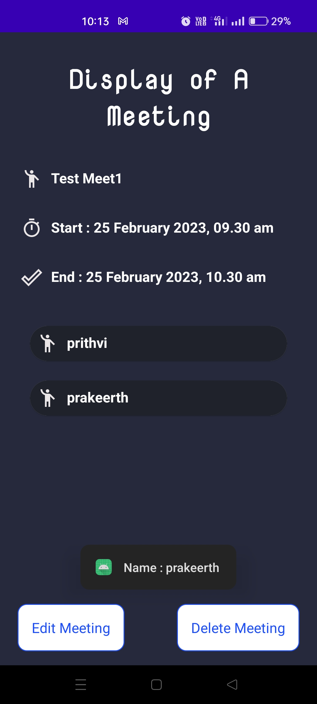
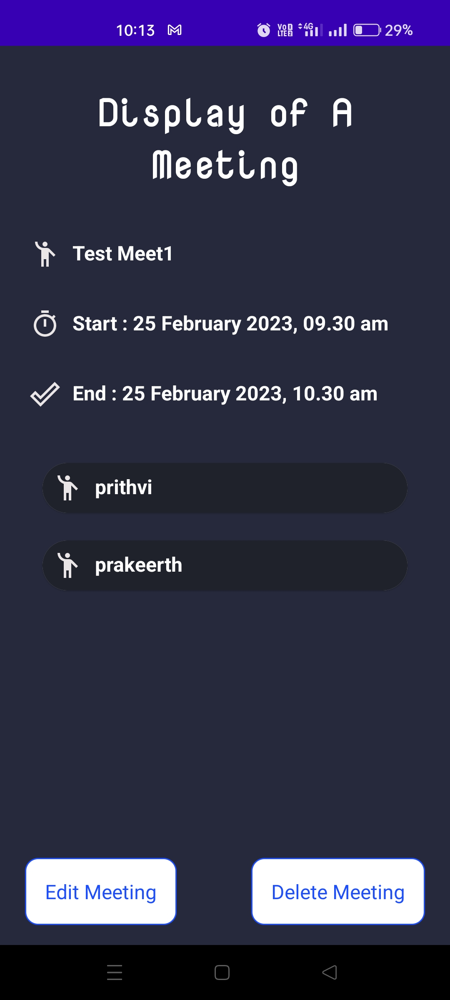
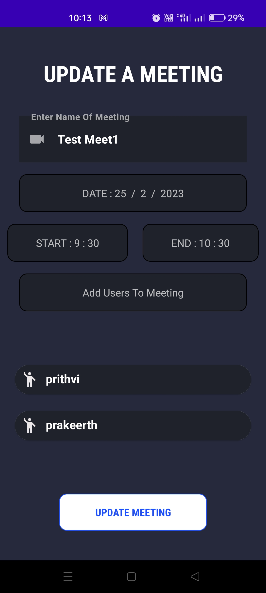
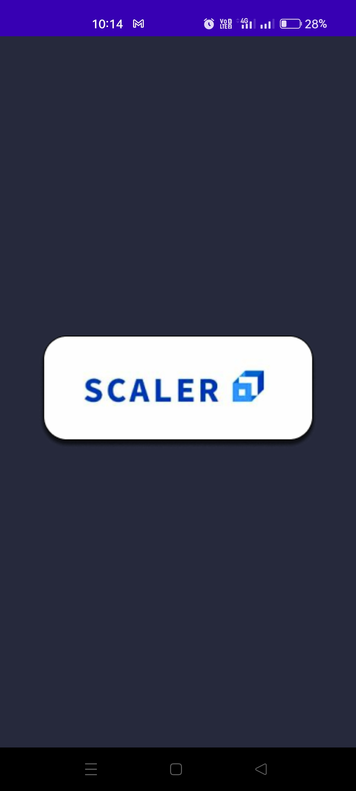

# Scaler_Interview_Portal
***
### [App Apk(Download App here)](https://drive.google.com/drive/folders/1p5HrdatAvtaNDeBQywB0AgYIhUo0NQ5U?usp=share_link)

## Problem Description
Create a simple app where admins can create interviews by selecting participants, interview start time and end time

* An interview creation page where the admin can create an interview by selecting participants, start time and end time. Backend should throw error with proper error message if: 
  - Any of the participants is not available during the scheduled time (i.e, has another interview scheduled)
  - No of participants is less than 2
* An interviews list page where admin can see all the upcoming interviews.
* An interview edit page where admin can edit the created interview with the same validations as on the creation page.

* The APP is made using **Kotlin** and **Firebase** as Database.

***
## Screenshots

  
&nbsp; &nbsp; &nbsp; &nbsp;
  

  
&nbsp; &nbsp; &nbsp; &nbsp;
  

  
&nbsp; &nbsp; &nbsp; &nbsp;
  

***

## App Video 

https://drive.google.com/drive/folders/1p5HrdatAvtaNDeBQywB0AgYIhUo0NQ5U?usp=share_link
